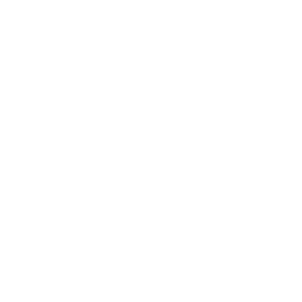

#  ***_Hey , I'm Sana Shaju_***
     

## 🔗 Links

   

##  My Stats 

<!--  -->

<!-- -->

# 🛠️ Tech Stack Skills

### 💻 Operating Systems

### 💻 Languages

### 💻 Front-End Development

### 💻 Back-End Development

### 💻 Database

### 💻 Testing

### 💻 DevOps

### 💻 Design Tools

### 💻 Development Tools

## 🔗 Links        

   

 
<em><b>I love connecting with different people</b> so if you want to say <b>hi, I'll be happy to meet you more!</b> :)</em>

  

